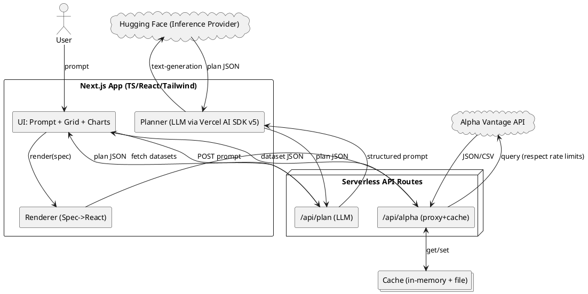
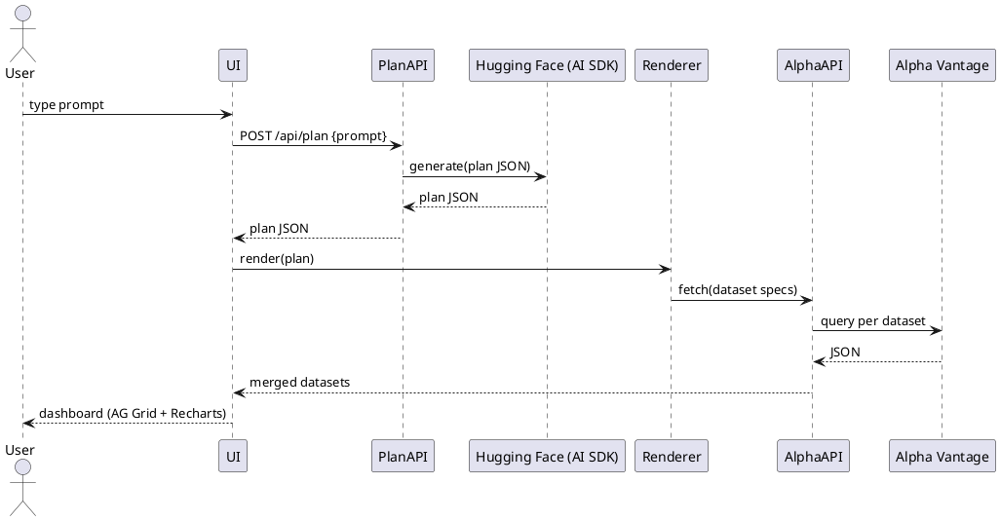

# SPEC-1-AI-Generated Dashboard Builder (SelectQuote Demo)

## Background

SelectQuote’s Fintech team wants a compelling demo to showcase **Generative UI**—where users describe what they want and the application assembles a working dashboard (data sources, queries, charts, layout) automatically.

This MVP focuses on:

- A **prompt-to-dashboard** flow: user enters a natural-language request and the app proposes data pulls (from a public API), chart types, transformations, and a responsive layout.
- **Live data via a public API** so the dashboards feel real, not mocked. (Examples we could consider later: market quotes, company fundamentals, economic indicators.)
- **CodeSandbox + GitHub-first** workflow so it’s easy to share, iterate, and version.
- **Phase 1**: single-tenant demo, no auth/roles beyond simple “viewer vs. builder” modes.
- **Phase 2 (optional)**: permissions/role-based access, saved dashboards with sharing controls.

Assumptions (for now):

- Tech stack will be **Next.js (TypeScript) + React + Tailwind** running in CodeSandbox (Pro), with a minimal serverless API route to proxy keys.
- **LLM** via **Vercel AI SDK v5** with **Hugging Face Inference Providers** (primary) and **OpenAI** as a fallback provider.
- **Data provider**: **Alpha Vantage** public API for equities/FX/crypto time series and indicators.

## Requirements

### MoSCoW

**Must Have**

- Prompt-to-dashboard generation: User describes a dashboard; the system returns a plan (data queries, chart specs, layout) and renders it.
- Live data from **Alpha Vantage** using a server-side proxy (no client-exposed keys). Respect free-tier limits (design for ~25 requests/day, ~5 req/min) with caching and query batching.
- Next.js + React + Tailwind app that runs in **CodeSandbox** and connects to a **GitHub** repo.
- Use **Vercel AI SDK v5** with **Hugging Face provider** for NL→dashboard planning; allow provider switching via env config.
- At least 3 chart types (Line, Bar, Area) + KPI tiles, with a simple grid layout (drag/snap optional in Phase 1).
- Simple persistence (in-memory or localStorage) for the **current session** dashboard so live editing is demoable.
- Zero-cost/low-cost operation for demo: aggressive caching, static examples when rate-limited, graceful fallbacks.

**Should Have**

- Deterministic re-run: a “Rebuild” button that replays the last plan without re-calling the LLM when possible.
- Basic data transforms: resampling (daily/weekly), moving averages, % change, combine two tickers.
- Export: shareable JSON spec of the dashboard (can be committed to GitHub).

**Could Have**

- Light theming (dark/light), chart annotations from prompt, and a small template gallery ("Market Overview", "Tech vs SPY", "FX Heatmap").
- Minimal roles demo: **Builder** vs **Viewer** toggle (client-only), to tease Phase 2 permissions.

**Won’t Have (Phase 1)**

- Multi-user accounts, org RBAC, SSO.
- Persistent cloud DB for saved dashboards (Phase 2).
- Real-time tick-by-tick streams; intraday limited to what Alpha Vantage free tier allows.

### Constraints & Assumptions

- **Cost**: Prefer HF Inference Providers free/serverless tier; swap to OpenAI only if HF limits block the demo. Keep Alpha Vantage within free tier.
- **Security**: API keys only in server-side routes; no secrets in client bundle.
- **Performance**: Cache Alpha Vantage responses (filesystem/memory) and hydrate on client. Backoff when rate limited.
- **Licensing**: Libraries under permissive licenses (MIT/Apache): Recharts (MIT), Tailwind (MIT), Vercel AI SDK (MIT).

### Acceptance Criteria (Phase 1)

- From a single text prompt like: _“Build a dashboard comparing AAPL vs MSFT YTD, add 20/50-day MAs, plus a KPI for AAPL latest close.”_ the app renders a working dashboard in <10s using Alpha Vantage data, with at least two charts and one KPI tile.
- Works end-to-end in CodeSandbox without extra setup beyond pasting env keys.
- Provider can be switched via env (`HF_API_KEY` vs `OPENAI_API_KEY`) without code changes.
- Handles Alpha Vantage rate-limit gracefully: shows cached/last-good data or demo snapshot with a banner.

## Method

### High-Level Architecture



**Notes**

- Single Next.js app with two serverless routes. Client never sees API keys.
- Caching layer (in-memory during session + optional file-cache in CodeSandbox sandbox FS) reduces Alpha Vantage calls.

### Core Data Contracts

**1) Dashboard Plan (LLM output)**

```ts
export type DashboardPlan = {
  title: string;
  datasets: Array<{
    id: string; // e.g., "aapl_daily"
    source: "alphaVantage";
    function:
      | "TIME_SERIES_DAILY"
      | "TIME_SERIES_INTRADAY"
      | "TIME_SERIES_WEEKLY";
    symbol: string; // e.g., "AAPL"
    interval?: "1min" | "5min" | "15min" | "30min" | "60min"; // intraday only
    indicators?: Array<{
      type: "SMA" | "EMA" | "RSI"; // subset for MVP
      period: number; // e.g., 20
      sourceField?: "close" | "open" | "high" | "low"; // default close
    }>;
    transforms?: Array<
      | { type: "resample"; to: "daily" | "weekly" | "monthly" }
      | { type: "%change"; window?: number }
    >;
  }>;
  widgets: Array<
    | {
        type: "line" | "area" | "bar";
        title: string;
        datasetId: string;
        x: string;
        y: string[];
      }
    | {
        type: "kpi";
        title: string;
        datasetId: string;
        agg: "latest" | "avg" | "min" | "max";
        field: string;
      }
  >;
  layout: Array<{
    widgetIndex: number;
    w: number;
    h: number;
    x: number;
    y: number;
  }>;
};
```

**2) Alpha Vantage Proxy Request**

```ts
// /api/alpha?fn=TIME_SERIES_DAILY&symbol=AAPL
// Optionally: &interval=5min for intraday
```

### Provider Setup (LLM)

- Use **Vercel AI SDK v5** with **Hugging Face provider** (`@ai-sdk/huggingface`). Environment: `HF_API_KEY`. Switchable via config to OpenAI.

### Alpha Vantage Integration

- Endpoints: `TIME_SERIES_DAILY`, `TIME_SERIES_INTRADAY (1/5/15/30/60min)`, sample indicators `SMA`. Free tier ≈ **25 requests/day**, **~5/min**.

### Proxy & Cache Algorithm

1. Normalize key: `fn|symbol|interval|range`.
2. Check in-memory cache (TTL e.g., 15 minutes for intraday, 6 hours for daily).
3. If miss, check file-cache (serialize JSON under `/tmp/alpha-cache/`).
4. If miss, call Alpha Vantage; on 200, store in both caches; if **rate-limited**, return last-good cached copy with banner.
5. Support `format=csv` passthrough if needed.

### Client Rendering

- **Tables**: **AG Grid React (Community)** for tabular views of fetched datasets.
- **Charts**: **Recharts** Line/Area/Bar; examples available and MIT licensed.

**Spec → Recharts Mapping**

- `widgets[type=line|area|bar]` → `<LineChart|AreaChart|BarChart>` with X=`time` and multiple Y series from `y[]`.
- KPIs compute aggregates client-side over cached dataset.

### Minimal Persistence (Phase 1)

- Current dashboard stored in `localStorage` under `sq-genui-dashboard`.
- Export/import JSON spec; optional GitHub commit by copying JSON manually into repo (no server required).

### Sequences

**Prompt → Plan → Render**



### Error & Rate Limit Handling

- If `/api/alpha` returns rate-limit or error, renderer shows banner: _“Using cached data (timestamp)”_ and continues.
- Backoff with `Retry-After` if provided; otherwise exponential starting at 2s.
- Batch indicator calls by computing simple indicators (e.g., SMA/EMA) client-side when possible to save requests; only call AV’s indicator API when explicitly requested. (SMA formula included in client util.)

### Security

- All secrets in env (`ALPHA_VANTAGE_API_KEY`, `HF_API_KEY`).
- Only server routes talk to third-party APIs. CORS locked to same-origin.

## Implementation

### Getting Started (CodeSandbox + GitHub)

1. **Create sandbox:** Next.js (App Router) + TypeScript. Connect to your GitHub; repo name: `sq-gendash` under **samasastudio/sq-gendash**.
2. **Add env secrets:** `ALPHA_VANTAGE_API_KEY`, `HF_API_KEY`.
3. **Install deps:**

   ```bash
   pnpm add ai @ai-sdk/huggingface zod ag-grid-community ag-grid-react recharts class-variance-authority clsx
   pnpm add -D tailwindcss postcss autoprefixer @types/node @types/react
   ```

4. **Init Tailwind:** `npx tailwindcss init -p`; set `content` to `./app/**/*.{ts,tsx}`.
5. **Paste code** from sections below into matching files/paths.
6. **Run:** ensure `/api/plan` returns JSON; try prompt: _"AAPL daily close with a KPI of latest close and a line chart of close vs time."_

### Quick Copy/Paste Checklist (samasastudio/sq-gendash)

- [ ] Create repo **samasastudio/sq-gendash** (public is fine for demo).
- [ ] In CodeSandbox: New → Next.js (TS) → Connect to **samasastudio/sq-gendash**.
- [ ] Add Secrets: `ALPHA_VANTAGE_API_KEY`, `HF_API_KEY`.
- [ ] Install deps (commands above) & init Tailwind.
- [ ] Create files exactly as shown (API routes, components, lib, CSS).
- [ ] Paste **Sample Plan JSON** into `localStorage` (LLM-off), verify charts/table render.
- [ ] Flip to LLM-on by using the Prompt form; confirm strict JSON plan.

### File Structure

```
app/
  api/
    plan/route.ts           # LLM planner (strict JSON via zod schema)
    alpha/route.ts          # Alpha Vantage proxy with cache & rate-limit handling
  (components)/
    PromptForm.tsx
    DashboardViewport.tsx
    widgets/
      ChartWidget.tsx
      KpiWidget.tsx
      DataGrid.tsx
  (lib)/
    plan-schema.ts          # zod schema for DashboardPlan
    alpha.ts                # client helper for proxy calls (optional)
    cache.ts                # in-memory cache utils
    indicators.ts           # SMA/EMA/RSI (client-side)
  page.tsx                  # main page (builder/viewer)
  globals.css               # Tailwind base
```

<!-- (existing code from earlier sections remains below) -->

## Milestones

**Phase 0 — Bootstrap (Complexity: Low)**

- Repo `sq-gendash`, CodeSandbox wired to GitHub, Tailwind configured, env secrets added.
- Health check: `/api/plan` returns schema-valid empty example; `/api/alpha?fn=TIME_SERIES_DAILY&symbol=AAPL` returns JSON.

**Phase 1 — Prompt → Plan → Render MVP (Complexity: Medium)**

- Strict-JSON planner via Vercel AI SDK + Hugging Face.
- Alpha Vantage proxy with caching and rate-limit banner.
- Renderer supports: Line/Area/Bar charts, KPI tiles, one AG Grid data table.
- Acceptance: Single prompt yields 2 charts + 1 KPI using **daily** data only.

**Phase 1.1 — Stability & UX Polish (Complexity: Low)**

- “Rebuild (no-LLM)” button to replay last plan.
- LocalStorage save/load; toast for rate-limit; basic dark/light theme.

**Phase 1.2 — Data Enrichment (Complexity: Medium)**

- Client-side indicators (SMA/EMA/RSI) to reduce API calls.
- Simple transforms: resample to weekly, % change.

**Phase 2 — Permissions Teaser (Complexity: Low)**

- Client-only **Builder vs Viewer** switch; hide prompt/controls in Viewer.
- Non-auth roles demo to keep cost/complexity low.

### Phase 2 Stub — Builder vs Viewer (Client-only)

Add these files and a few lines in `page.tsx`. This keeps it toggleable with a single component and no backend.

**1) Role context & hook** — `app/components/role/RoleGate.tsx`

```tsx
"use client";
import { createContext, useContext, useEffect, useMemo, useState } from "react";

type Role = "builder" | "viewer";

type Ctx = { role: Role; setRole: (r: Role) => void };
const RoleCtx = createContext<Ctx | null>(null);

export function RoleProvider({ children }: { children: React.ReactNode }) {
  const [role, setRole] = useState<Role>("builder");

  // Initialize from URL (?role=viewer) or localStorage
  useEffect(() => {
    const url = new URL(location.href);
    const qRole = url.searchParams.get("role") as Role | null;
    const saved =
      (localStorage.getItem("sq-genui-role") as Role | null) ?? null;
    const next = qRole ?? saved ?? "builder";
    setRole(next);
  }, []);

  useEffect(() => {
    localStorage.setItem("sq-genui-role", role);
  }, [role]);

  const value = useMemo(() => ({ role, setRole }), [role]);
  return <RoleCtx.Provider value={value}>{children}</RoleCtx.Provider>;
}

export function useRole() {
  const ctx = useContext(RoleCtx);
  if (!ctx) throw new Error("useRole must be used within RoleProvider");
  return ctx;
}

export function RoleBanner() {
  const { role } = useRole();
  return (
    <div className="rounded border px-3 py-2 text-sm mb-3 flex items-center justify-between">
      <span>
        Role: <strong className="uppercase">{role}</strong>
      </span>
      <span className="opacity-70">
        Tip: append <code>?role=viewer</code> to share read-only view
      </span>
    </div>
  );
}
```

**2) Toggle component** — `app/components/role/RoleToggle.tsx`

```tsx
"use client";
import { useRole } from "./RoleGate";

export default function RoleToggle() {
  const { role, setRole } = useRole();
  return (
    <div className="inline-flex border rounded overflow-hidden">
      <button
        className={`px-3 py-1 ${
          role === "builder" ? "bg-black text-white" : "bg-transparent"
        }`}
        onClick={() => setRole("builder")}
      >
        Builder
      </button>
      <button
        className={`px-3 py-1 ${
          role === "viewer" ? "bg-black text-white" : "bg-transparent"
        }`}
        onClick={() => setRole("viewer")}
      >
        Viewer
      </button>
    </div>
  );
}
```

**3) Wire it up in `app/page.tsx`** — wrap with provider, hide prompt when `viewer`

```tsx
"use client";
import { useEffect, useState } from "react";
import PromptForm from "./components/PromptForm";
import DashboardViewport from "./components/DashboardViewport";
import { RoleProvider, useRole, RoleBanner } from "./components/role/RoleGate";
import RoleToggle from "./components/role/RoleToggle";

function PageInner() {
  const [plan, setPlan] = useState<any>(null);
  const [datasets, setDatasets] = useState<Record<string, any[]>>({});
  const { role } = useRole();

  useEffect(() => {
    localStorage.setItem(
      "sq-genui-dashboard",
      JSON.stringify({ plan, datasets })
    );
  }, [plan, datasets]);

  async function realizePlan(p: any) {
    setPlan(p);
    const out: Record<string, any[]> = {};
    for (const ds of p.datasets) {
      const url = new URL("/api/alpha", location.origin);
      url.searchParams.set("fn", ds.function ?? "TIME_SERIES_DAILY");
      url.searchParams.set("symbol", ds.symbol);
      if (ds.function === "TIME_SERIES_INTRADAY" && ds.interval) {
        url.searchParams.set("interval", ds.interval);
      }
      const res = await fetch(url);
      const json = await res.json();
      const parsed = normalizeAlpha(json.data);
      out[ds.id] = parsed;
    }
    setDatasets(out);
  }

  function normalizeAlpha(data: any): any[] {
    const key = Object.keys(data).find((k) => k.includes("Time Series"));
    const series = data && key ? data[key] : {};
    const rows = Object.entries(series ?? {}).map(([t, v]: any) => ({
      time: t,
      open: +v["1. open"],
      high: +v["2. high"],
      low: +v["3. low"],
      close: +v["4. close"],
      volume: +v["5. volume"],
    }));
    rows.sort((a, b) => (a.time < b.time ? 1 : -1));
    return rows;
  }

  return (
    <main className="p-6 max-w-6xl mx-auto space-y-4">
      <div className="flex items-center justify-between">
        <h1 className="text-2xl font-semibold">
          AI-Generated Dashboard Builder
        </h1>
        <RoleToggle />
      </div>
      <RoleBanner />
      {role === "builder" && <PromptForm onPlan={realizePlan} />}
      {plan && <DashboardViewport plan={plan} datasets={datasets} />}
      {role === "viewer" && !plan && (
        <div className="text-sm opacity-70">
          Viewer mode: share this URL with <code>?role=viewer</code> to hide
          builder controls.
        </div>
      )}
    </main>
  );
}

export default function Page() {
  return (
    <RoleProvider>
      <PageInner />
    </RoleProvider>
  );
}
```

**Usage**

- Toggle roles via the header switch, or append `?role=viewer` to the URL before sharing.
- Role persists in `localStorage` (`sq-genui-role`).

## Gathering Results

- **Demo script success criteria:**

  - From a prompt like _“Compare AAPL vs MSFT daily close YTD; add 20/50-day SMAs; KPI: latest close for both.”_ the app renders in one pass with valid data.
  - Rate-limit scenarios show cached data with clear banner.

- **Technical validation:**

  - LLM output passes Zod validation 100% of the time for 5+ common prompts.
  - Proxy cache hit ratio improves after first run; no secrets in client bundle.

- **Developer approachability checks:**

  - New dev can fork sandbox, paste two API keys, and produce a dashboard without code changes.
  - Code footprint remains small and well-structured (single app, two API routes, clear components).

## Need Professional Help in Developing Your Architecture?

Please contact me at [sammuti.com](https://sammuti.com) :)

- **Demo script success criteria:**

  - From a prompt like _“Compare AAPL vs MSFT daily close YTD; add 20/50-day SMAs; KPI: latest close for both.”_ the app renders in one pass with valid data.
  - Rate-limit scenarios show cached data with clear banner.

- **Technical validation:**

  - LLM output passes Zod validation 100% of the time for 5+ common prompts.
  - Proxy cache hit ratio improves after first run; no secrets in client bundle.

- **Developer approachability checks:**

  - New dev can fork sandbox, paste two API keys, and produce a dashboard without code changes.
  - Code footprint remains small and well-structured (single app, two API routes, clear components).

## Need Professional Help in Developing Your Architecture?

Please contact me at [sammuti.com](https://sammuti.com) :)

---

### Repo Note

You indicated you’ll use your **personal GitHub**. Use repo name: **`sq-gendash`**, e.g., `samasastudio/sq-gendash`.

### Seed Prompts & Sample Plan JSON (LLM-Off Demo Mode)

Use these to demo without calling the LLM (Phase 0/1):

**Seed Prompts**

1. _"Build a dashboard for **AAPL** daily close YTD. Add a **KPI** for latest close and a **line chart** of close over time."_
2. _"Compare **AAPL vs MSFT** daily closes; show a combined **line chart** and KPIs for each latest close."_
3. _"Show **SPY** daily with **20 & 50 day SMA** and a KPI for % change last 30 days."_

**Sample Plan JSON (paste into localStorage under `sq-genui-dashboard.plan` or pipe directly to `onPlan`)**

```json
{
  "title": "AAPL Daily — Close & KPI",
  "datasets": [
    {
      "id": "aapl_daily",
      "source": "alphaVantage",
      "function": "TIME_SERIES_DAILY",
      "symbol": "AAPL",
      "indicators": [
        { "type": "SMA", "period": 20, "sourceField": "close" },
        { "type": "SMA", "period": 50, "sourceField": "close" }
      ]
    }
  ],
  "widgets": [
    {
      "type": "kpi",
      "title": "AAPL Latest Close",
      "datasetId": "aapl_daily",
      "agg": "latest",
      "field": "close"
    },
    {
      "type": "line",
      "title": "AAPL Close with 20/50 SMA",
      "datasetId": "aapl_daily",
      "x": "time",
      "y": ["close", "sma_20", "sma_50"]
    }
  ],
  "layout": [
    { "widgetIndex": 0, "w": 6, "h": 2, "x": 0, "y": 0 },
    { "widgetIndex": 1, "w": 12, "h": 6, "x": 0, "y": 2 }
  ]
}
```

**How to inject quickly**

- In DevTools console (on the running app), run:

```js
localStorage.setItem(
  "sq-genui-dashboard",
  JSON.stringify({ plan: YOUR_JSON, datasets: {} })
);
location.reload();
```
